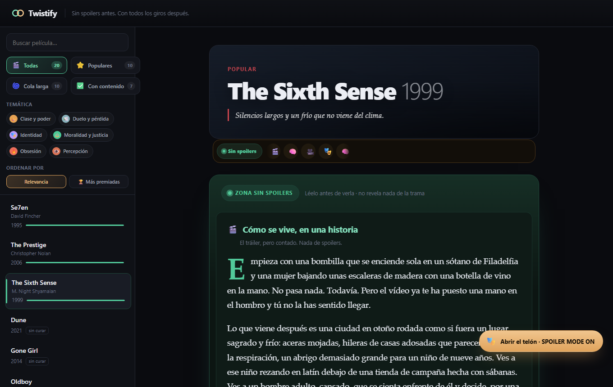
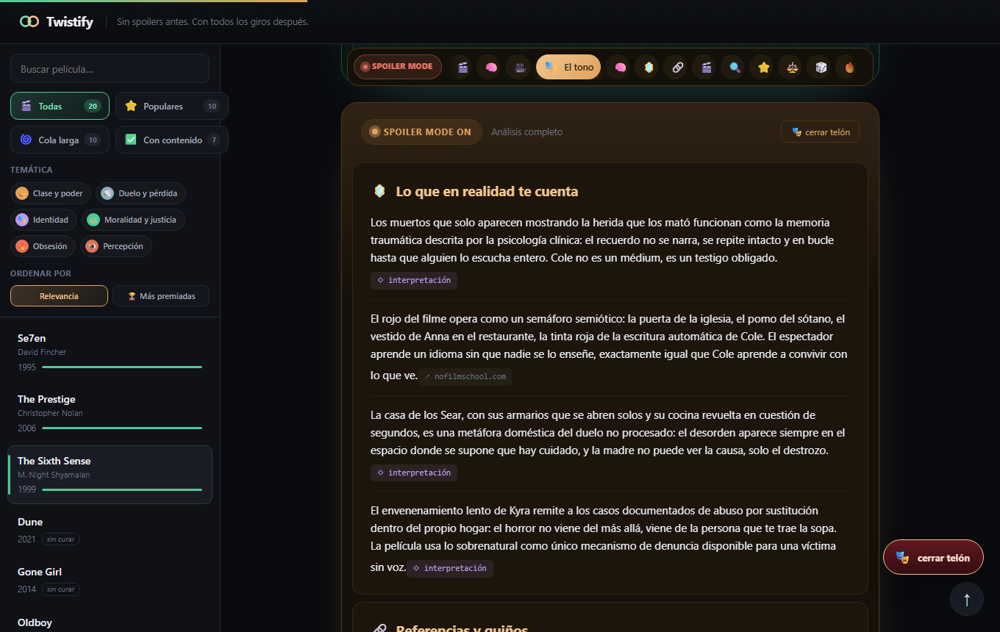

# 🎬 Twistify

**Spoiler-free before. Every twist after.**

[](https://github.com/serpeigd/Twistify/actions/workflows/tests.yml)


Twistify is a movie app with a rule that's actually enforced, not just
promised: the plot never leaves the server until you say you've already
seen it. Underneath, an evaluation harness measures whether that promise
holds — with numbers, not a self-awarded green badge.

**Live demo:** [twistify.onrender.com](https://twistify.onrender.com)
(Render free tier — the instance spins down after 15 min idle, so the
first request after a while takes ~1 min to cold-start; that's expected,
not broken. It also wipes its filesystem on every redeploy/spin-down, so
comments and movie suggestions reset — see [Limitations](#limitations).)

<p align="center">
  
  
</p>

---

## Try it in 2 minutes

```bash
git clone https://github.com/serpeigd/Twistify.git
cd Twistify
pip install fastapi "uvicorn[standard]" pydantic pyyaml
python webapp/app.py
# open http://127.0.0.1:8000
```

Pick a researched movie (Sixth Sense, Fight Club, Get Out, Parasite, The
Prestige, Se7en, Arrival, or Gone Girl), read the spoiler-free entry, and
when you're ready, open the curtain. The other 12 titles in the catalogue
show a live TMDB poster/synopsis instead (see [Browse tier](#browse-tier-tmdb)) — no
API key needed for any of this, `TMDB_READ_ACCESS_TOKEN` just upgrades
those placeholders to real posters.

## What makes this different from "another movie CRUD"

- **The spoiler partition is a server-side property, not a UI promise.**
  Post-viewing content isn't sent to the browser until the client declares
  `seen=true` — opening devtools reveals nothing. It's not CSS hiding a
  `<div>`.
- **Every factual claim says whether it has a source or not.** No faking
  `source_id`s when there's no real retrieval behind it. The gap is shown,
  not disguised.
- **The spoiler-leak detector itself is measured, not assumed.** There's an
  evals harness (`evals/`) that calibrates the judge against planted leaks
  and reports its real recall — including the uncomfortable case where the
  cheap judge fails (see [Results](#under-the-hood-the-evaluation-harness)).
- **Filters that actually mean something.** Themes (identity, obsession,
  class and power…) that group several movies for real, not a one-off tag
  per title.
- **Scaling the researched catalogue automates the labor, not the
  citation bar.** `webapp/research_assist.py` (see
  [Research-assist tool](#research-assist-tool-scaling-the-researched-catalogue))
  drafts a new researched entry from real Wikipedia + TMDB retrieval, but
  every claim still needs a real source URL — a code-level sanitizer strips
  any citation the model invents, and a human review gate still sits
  between a draft and `content/researched/`.

## Stack

**Backend:** Python 3.12 · FastAPI · Pydantic v2 (typed data contracts, not
loose dicts) · pytest (evals harness, runs with no network, no API key)

**Frontend:** vanilla HTML/CSS/JS — no framework, on purpose: the app is
small enough that a framework would be cost without benefit, not "doesn't
know how to use one."

**AI / evaluation:** Anthropic Claude (tool use / structured output for the
paid baseline generator + research-assist drafting) · Groq/Llama (free-tier
alternative for the same baseline generator, the `LLMJudge`, and
research-assist's default model, so nothing in this project *requires* a
paid key) · a custom evals harness design (leakage / grounding / richness)
with a calibrated judge, verified against planted leaks and real human
spoiler reviews.

**Data sources:** TMDB (free, attributed — browse-tier posters/search,
research-assist metadata) · Wikipedia (CC BY-SA — research-assist
retrieval) · MyMemory (free — on-the-fly Spanish translation, cached) ·
Upstash Redis free REST API (optional — durable comments/movie-requests
on a redeploy; falls back to local files without it).

**CI:** GitHub Actions runs the 8 tests on every push (see badge above).

## How it's built

| Piece | What it is |
|---|---|
| `webapp/app.py` | FastAPI + vanilla JS. Serves the catalogue, runs the spoiler gate, comments (edit/delete with no accounts, anonymous per-browser token). |
| `webapp/research_assist.py` | Drafts a new researched entry from real Wikipedia + TMDB retrieval (never LLM memory) — see [Research-assist tool](#research-assist-tool-scaling-the-researched-catalogue). |
| `webapp/prewarm_translations.py` | One-time build step: caches Spanish translations of researched + browse-tier content so the live deploy never calls the translation API on a visitor's request. |
| `webapp/resolve_tmdb_ids.py` | One-time helper: resolves a `tmdb_id` for every title in `evals/dataset/titles.yaml` so the browse tier can show a poster for all 20. |
| `content/researched/*.json` | 8 hand-researched entries (with cited sources: Wikipedia, Hollywood Reporter, No Film School…), not generated by an unverified LLM. |
| `src/preshow/` | Data contracts (Pydantic) for both the researched content and the measurement harness, plus the TMDB/Wikipedia/translation/KV-store clients. |
| `evals/` | The real experiment: leakage/grounding/richness metrics, calibrated judge, 20-title stratified dataset, external calibration scripts. |
| `docs/DESIGN.md` | Every non-trivial design decision (D1–D14) with its trade-off, written as it was made. |

## Status

| What | Status |
|---|---|
| Twistify app (catalogue, spoiler gate, filters, comments) | ✅ 8/20 entries researched |
| Browse catalogue (TMDB posters, live search, ES/EN) | ✅ 20/20 have posters, search reaches all of TMDB |
| Offline evals harness | ✅ 8 tests passing |
| Spoiler ground truth (20 titles) | ✅ 20/20, researched with cited sources |
| Baseline generator (no retrieval) | ✅ two providers — Anthropic (paid) and Groq (free tier, no card) |
| Judge calibration (offline + real spoiler reviews) | ✅ both judges calibrated against the same external human data — `SubstringJudge` recall=0.0, `LLMJudge` recall=0.089/precision=0.471 — **neither clears the bar to trust a `leakage_rate` yet** (see [Limitations](#limitations)) |
| Measure the baseline over the 20 titles | ✅ done — see numbers and caveats below |
| Research-assist tool (D14) | ✅ drafts a researched entry from Wikipedia + TMDB; tested end-to-end on one title (Citizen Kane) |
| Retrieval (TMDB/OMDb/Wikipedia) + verifier | ⬜ next milestone — blocked on judge trust, see [Roadmap](#roadmap) |

## Under the hood: the evaluation harness

The part you don't see in the screenshots is what backs the app's promise:
a system that **measures**, instead of promising, three things per entry:

1. **`leakage_rate`** — did any spoiler slip into the pre-viewing content?
2. **`grounded_fact_rate`** — how many claims carry a real source?
3. **`richness`** — how much does it actually say? (an empty output scores
   perfectly on the first two — that's why it's never reported without
   this one)

```bash
python -m pytest tests/ -q                            # 8/8, no network, no API key
python evals/run_eval.py --generator baseline-groq    # free tier, no card
python evals/run_eval.py --generator baseline         # or the paid Anthropic version
```

### Milestone 0 results (no-retrieval baseline, Groq/Llama-3.3-70B, 20 titles)

| Metric | Mainstream | Long-tail | Overall |
|---|---|---|---|
| `leakage_rate` | 0.0 | 0.0 | 0.0 |
| `grounded_fact_rate` | 0.0 | 0.0 | 0.0 |
| `richness` (claims/case) | 6.0 | 6.0 | 6.0 |

**Read this table with its caveats, not instead of them:**

- **`leakage_rate = 0.0` is not a safety result — it's the judge's blind spot.**
  `SubstringJudge` was calibrated offline at **recall = 0.0**: it only catches
  verbatim spoiler phrases, never a paraphrase. A 0.0 leakage rate here most
  likely means the judge failed to see leaks that are actually there, not
  that the baseline is safe. Trusting this number without the calibration
  note next to it is exactly the mistake this project exists to avoid.
- **`grounded_fact_rate = 0.0` is a real, expected finding.** The baseline is
  given no retrieval corpus (`corpus=[]`) and is explicitly instructed never
  to invent a source id. Zero real sources in, zero real sources out — this
  is the quantitative baseline Milestone 1 (retrieval) needs to beat, not a
  bug.
- **`richness = 6.0`** confirms the generator isn't gaming the first two
  metrics by returning an empty brief.
- **Mainstream and long-tail are identical here**, which means this run
  *cannot yet confirm or deny* the project's original hypothesis (that a
  no-retrieval baseline degrades on long-tail titles) — a judge with 0.0
  recall can't see a gap that might exist. See below: this is no longer a
  missing-dataset problem, it's a judge problem.

### External judge calibration (IMDB Spoiler Dataset, real user reviews)

The calibration above uses the project's own LLM-written paraphrases —
useful, but it's an LLM checking an LLM. `evals/calibrate_substring_external.py`
re-runs it against real IMDb user reviews (Misra's IMDB Spoiler Dataset,
Kaggle, free), restricted to the 9 of our 20 titles the dataset covers
(mostly mainstream — long-tail titles here barely have review coverage at
all, a small real echo of the project's own mainstream/long-tail split):

| | Value |
|---|---|
| Reviews evaluated | 2,197 real spoiler-tagged + 5,460 real non-spoiler-tagged |
| **Recall** | **0.0** — caught 0 of 2,197 |
| Precision | undefined (0 positive predictions made — not "wrong every time") |

**Same conclusion, now independently confirmed**: `SubstringJudge` doesn't
just fail on paraphrases it's never seen from itself — it fails on plain
human language. See D12 in `docs/DESIGN.md` for the one caveat this
comparison carries (a review can be a real spoiler for a plot point we
didn't document, which the method above counts as a miss even though it
isn't the judge's fault).

### `LLMJudge`, calibrated the same way (Groq free tier)

`evals/calibrate_llm_external.py` re-runs the exact same method against
`LLMJudge` (`llama-3.1-8b-instant`, Groq's free tier) instead of
`SubstringJudge`. Free-tier limits (1,000 requests/day, and every review
costs `len(that movie's labels)` calls) meant a smaller, seeded, stratified
sample — 180 reviews (20/title, balanced spoiler/not) instead of the full
7,657 — and review text truncated to 350 characters/call to stay under
the tokens/min cap:

| Judge | n | Recall | Precision |
|---|---|---|---|
| `SubstringJudge` | 7,657 | 0.0 | undefined |
| `LLMJudge` (llama-3.1-8b-instant) | 180 | **0.089** | 0.471 |

A real improvement over the free floor — it sees paraphrases the substring
judge structurally cannot — but not yet trustworthy: it misses ~91 of every
100 real spoiler reveals in this sample, and fewer than half its positive
calls are right. Two things this run can't separate (see D13 in
`docs/DESIGN.md`): whether that ceiling is the small model or the 350-char
truncation forced by the token budget. Neither judge currently clears the
bar to report a trustworthy `leakage_rate`.

The decisions behind this design (why there's no LangGraph, why the schema
allows invalid states on purpose, why the same model being measured can't
generate its own ground truth) are documented in
[`docs/DESIGN.md`](docs/DESIGN.md).

## Research-assist tool: scaling the researched catalogue

Hand-researching an entry (cited sources, no invented facts) takes ~15
minutes each — fine for 8 titles, not for the "most important films in
cinema history" the catalogue is meant to grow into. `webapp/research_assist.py`
automates the *labor* of that process, not the citation bar itself:

```bash
python webapp/research_assist.py "Citizen Kane" 1941
```

1. **Real retrieval, never LLM memory.** Fetches the film's Wikipedia
   article (`src/preshow/wikipedia.py`) and its TMDB metadata/director
   (`src/preshow/tmdb.py`), and gives the model *only* that retrieved text
   to draft from — the prompt explicitly forbids citing anything else.
2. **Best-of-3 drafting.** A single free-model call was inconsistent run
   to run (4–15 grounded claims from the same prompt against the same
   text — see D14 in `docs/DESIGN.md`), so `draft_best_of()` generates 3
   independent candidates from the same retrieved text and keeps the one
   with the most grounded, unfabricated claims.
3. **A code-level safety net, not just a prompt instruction.**
   `sanitize_grounding()` walks every citation in the draft and nulls out
   anything that isn't exactly a URL this run actually retrieved — it
   already caught the model inventing a plausible-looking Rotten Tomatoes
   URL in testing.
4. **Output never bypasses human review.** Drafts are written to
   `content/_drafts/` (gitignored), never straight to
   `content/researched/` — a human still has to read and promote a draft
   before it's published, same bar as the existing 8 entries.

**Status:** tested end-to-end on one title (Citizen Kane, 3/3 candidates
succeeded: 4, 4, and 5 grounded claims, correctly picked the 5, zero
fabricated citations reached the output). Needs `GROQ_API_KEY` (free).
See [Roadmap](#roadmap) for what's next.

## Browse tier: TMDB

The 12 titles in the 20-title measurement set that aren't hand-researched
yet still show a real poster and synopsis instead of an empty
placeholder, and `/api/search` reaches effectively all of TMDB — this is
a deliberately separate, lower tier: it never claims to be spoiler-safe
or cited the way `content/researched/*.json` is (see D10 in
`docs/DESIGN.md`). Needs `TMDB_READ_ACCESS_TOKEN`; without it, the app
still runs, it just shows the "not researched yet" placeholder instead of
a poster.

## Configuration

Everything in the [quickstart](#try-it-in-2-minutes) works with **zero
keys** — the demo app, its comments, and the offline evals harness
(`pytest tests/`) need nothing. Every key below is an optional upgrade,
never a requirement; all are read from a gitignored `.env` in the repo
root (`src/preshow/env.py`, falls back to the real environment too — no
`python-dotenv` dependency).

| Variable | Unlocks | Cost |
|---|---|---|
| `TMDB_READ_ACCESS_TOKEN` | Browse-tier posters/search for the 12 not-yet-researched titles (D10) | Free, [themoviedb.org](https://www.themoviedb.org/settings/api) |
| `GROQ_API_KEY` | `--generator baseline-groq`, `LLMJudge` external calibration, `research_assist.py` | Free tier, no card, [console.groq.com/keys](https://console.groq.com/keys) |
| `ANTHROPIC_API_KEY` | `--generator baseline` (Claude instead of Groq for the same baseline generator) | Paid — the *only* piece of this project that costs money, and it's opt-in |
| `UPSTASH_REDIS_REST_URL` + `UPSTASH_REDIS_REST_TOKEN` | Comments/movie-requests survive a redeploy on a free host with an ephemeral filesystem (D11) | Free, no card, [console.upstash.com](https://console.upstash.com) |

Full install, including the optional pieces:

```bash
pip install fastapi "uvicorn[standard]" pydantic pyyaml   # core app + harness
pip install groq                                          # optional: baseline-groq, LLMJudge calibration, research_assist.py
pip install anthropic                                     # optional: paid baseline generator only
```

## Project layout

```
webapp/                 FastAPI app, one-time build helpers, research-assist tool
  app.py                 serves the catalogue, spoiler gate, comments, search
  index.html              vanilla HTML/CSS/JS frontend
  research_assist.py     drafts a researched entry from Wikipedia + TMDB (D14)
  prewarm_translations.py  build step: caches ES translations
  resolve_tmdb_ids.py     build step: resolves tmdb_id for every title

src/preshow/             shared library: schemas, clients, generators
  schemas.py               Pydantic data contracts (Claim, PreShowBrief, ContentPack…)
  baseline.py / baseline_groq.py / baseline_prompts.py   no-retrieval baseline generator (2 providers, 1 prompt)
  content.py                loads/serves content/researched/*.json
  tmdb.py / wikipedia.py    stdlib-only clients for the browse tier and research-assist retrieval
  translate.py               free MyMemory API client, disk-cached
  kv_store.py                Upstash Redis client with a local-file fallback
  env.py                     shared .env reader

evals/                   the real experiment (measurement track)
  run_eval.py               runs the baseline over the 20-title dataset
  judge.py                   SubstringJudge + LLMJudge
  metrics.py                  leakage_rate / grounded_fact_rate / richness
  calibrate_substring.py               internal calibration (LLM paraphrases)
  calibrate_substring_external.py      SubstringJudge vs. real IMDb reviews (D12)
  calibrate_llm_external.py             LLMJudge vs. the same real reviews (D13)
  dataset/titles.yaml                    20-title stratified spoiler ground truth

content/
  researched/*.json        8 hand-researched, cited entries
  _translations/            cached ES translations (committed — see D9)
  _drafts/                    research_assist.py output (gitignored, pre-review)
  _tmdb_cache/                 (gitignored)

tests/                   offline pytest suite (8 tests), no network, no API key
docs/DESIGN.md            every design decision (D1–D14) with its trade-off
docs/screenshots/          the two screenshots at the top of this README
.github/workflows/tests.yml   CI: installs core deps, runs pytest on every push/PR
```

## Roadmap

Documented as open, not started, in `docs/DESIGN.md`'s "Open questions"
and `CLAUDE.md`'s "Next task":

- **Resolve the judge-trust gap before Milestone 1 (retrieval).** Neither
  judge currently clears the bar to report a trustworthy `leakage_rate`
  (see [Limitations](#limitations)). Next concrete step: re-run
  `evals/calibrate_llm_external.py` with full, untruncated review text
  and/or a stronger model (`llama-3.3-70b-versatile`) to find out whether
  today's 0.089 recall is a real model-capacity ceiling or an artifact of
  the 350-char truncation forced by this run's token budget. If that's
  still not good enough, two genuinely different alternatives are on the
  table but not started: a lightweight local NLI/entailment classifier
  (no per-call cost or rate limit), or a classifier trained directly on
  this project's own 2,197-positive/5,460-negative external labels with a
  proper held-out split.
- **Research the remaining 12 measurement titles** the same way Gone Girl
  was (cited sources, no invented facts) — `research_assist.py` is the
  start of automating this, once its output quality is more consistent
  than a single Citizen Kane run has proven so far.
- **Automate the "+ Suggest a movie" pipeline.** It already resolves a
  `tmdb_id` per suggestion via TMDB autocomplete, but doesn't research or
  add anything automatically yet — that's exactly what
  `research_assist.py` is the first step toward.
- **Upstash on the live Render deploy** — deliberately deferred (the
  project owner's call, not a blocker): comments/movie-requests on the
  live demo reset on every idle spin-down until an Upstash account is
  wired in. The code path (D11) already handles this gracefully (empty
  state, not an error).

## Limitations

Stated plainly, not hidden behind a green badge — this is the project's
own stated goal applied to itself:

- **Neither spoiler judge is trustworthy yet**, and no `leakage_rate` in
  this README should be read as a real safety measurement until this
  changes. `SubstringJudge` catches 0 of 2,197 real human spoiler reviews
  (recall = 0.0 — it only matches verbatim planted phrases). `LLMJudge`
  (Groq, `llama-3.1-8b-instant`) does better but still misses ~91 of every
  100 real spoiler reveals in its calibration sample (recall = 0.089,
  precision = 0.471, n=180 — see [`LLMJudge` calibration](#llmjudge-calibrated-the-same-way-groq-free-tier)).
  This is *why* Milestone 1 (retrieval) hasn't started — there's no point
  measuring whether retrieval helps against a judge that can't reliably
  see leaks either way.
- **`grounded_fact_rate = 0.0` on the current baseline is expected, not a
  bug** — the no-retrieval baseline is given no corpus on purpose; it's
  the number Milestone 1 needs to beat.
- **The mainstream vs. long-tail hypothesis is unconfirmed.** Both strata
  scored identically in the Milestone 0 run — a judge with ~0 real recall
  can't reveal a gap that might genuinely exist.
- **`research_assist.py` is tested on one title.** Best-of-3 generation
  fixed the run-to-run inconsistency seen on that one title (Citizen
  Kane); it hasn't been run across a larger, varied sample yet, so
  "consistent output quality" is a hypothesis, not yet a measured claim.
  It also can't cite Rotten Tomatoes/Metacritic directly (no simple free
  API for either) — a real, disclosed gap against the 8 hand-researched
  entries, which do cite those sites directly.
- **The live demo's comments/movie-requests reset on idle spin-down**
  (Render free tier wipes the filesystem; Upstash isn't wired in yet —
  see [Roadmap](#roadmap)). Known and accepted, not a bug to chase.

## Sources and legal restrictions

- **TMDB** — free for non-commercial use, requires attribution (shown in the
  app wherever TMDB data appears). Powers the browse tier (`src/preshow/tmdb.py`
  — live search, catalogue posters), separate from the hand-researched,
  cited-source tier (see D10 in `docs/DESIGN.md`). Its terms restrict using
  the content to *train* AI systems; inference with attribution is the
  usual reading, but review it before scaling this up further.
- **OMDb** — a path to Rotten Tomatoes/Metascore scores, free tier is
  limited.
- **Wikipedia** — CC BY-SA, already in use for researched entries.
- **Scraping IMDb** — forbidden by ToS, not done under any excuse.

## License

No license defined yet — personal portfolio repo. If you want to reuse
something, ask first.
